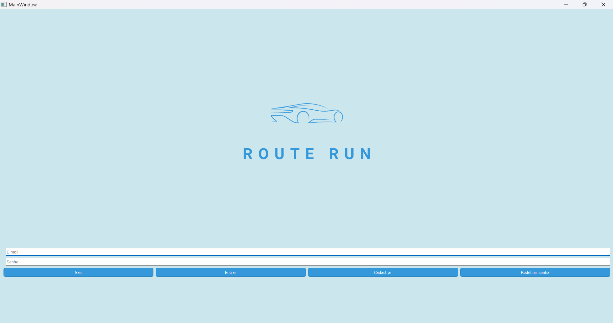
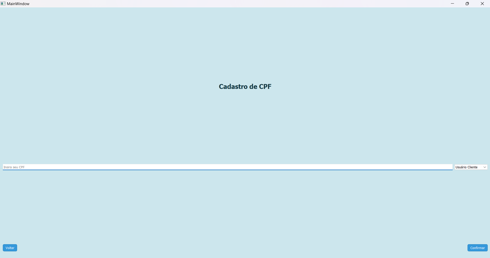
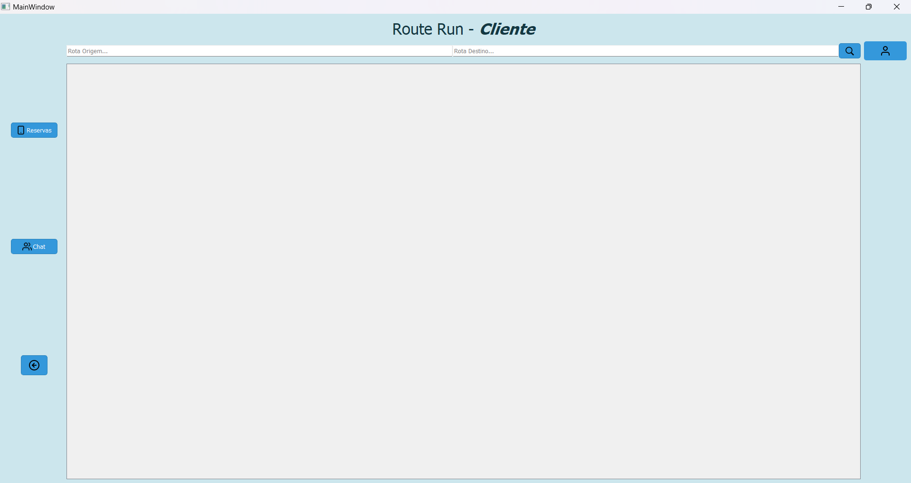
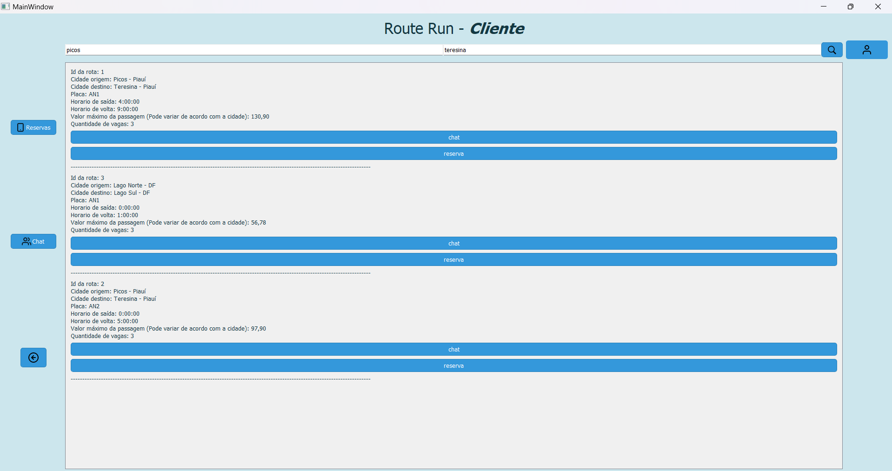

# Route Run

Este projeto foi inicialmente desenvolvido por dois amigos meus, <a href="https://github.com/MarcosAndreLS" target="_blank">Marcos André</a> e <a href="https://github.com/Tak3daaa" target="_blank">Pedro Vitor</a>, na disciplina de Programação Orientada a Objetos II. Após algum tempo, eu e o Alison Vitor, ficamos responsáveis por fazer algumas implementações no projeto para que a gente podesse submetê-lo na Campus Party.

## Tela de Login

<!-- ## Tela 
 -->
## Tela inicial

## Tela inicial após ser realizada a busca por uma rota

<!--  -->